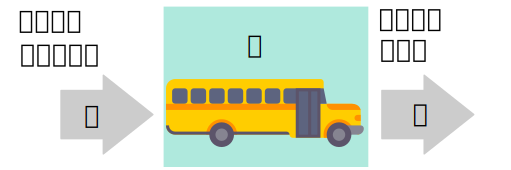

```{r setup, include=FALSE}
knitr::opts_chunk$set(echo = TRUE)
```

## に　で　を


<p>A figura abaixo exemplica como devemos memorizar o uso das partículas `に`, `で` e `を` no que tange o meio de transporte.</p>



## Exemplos

### `に`

* バスに　のりました。
* くるまに　はいります。

### `で`

* バスで　ほんを　よみました。
* くるまで　ゲームを　します。

### `を` 

* バスを　おります。
* くるまを　でました。